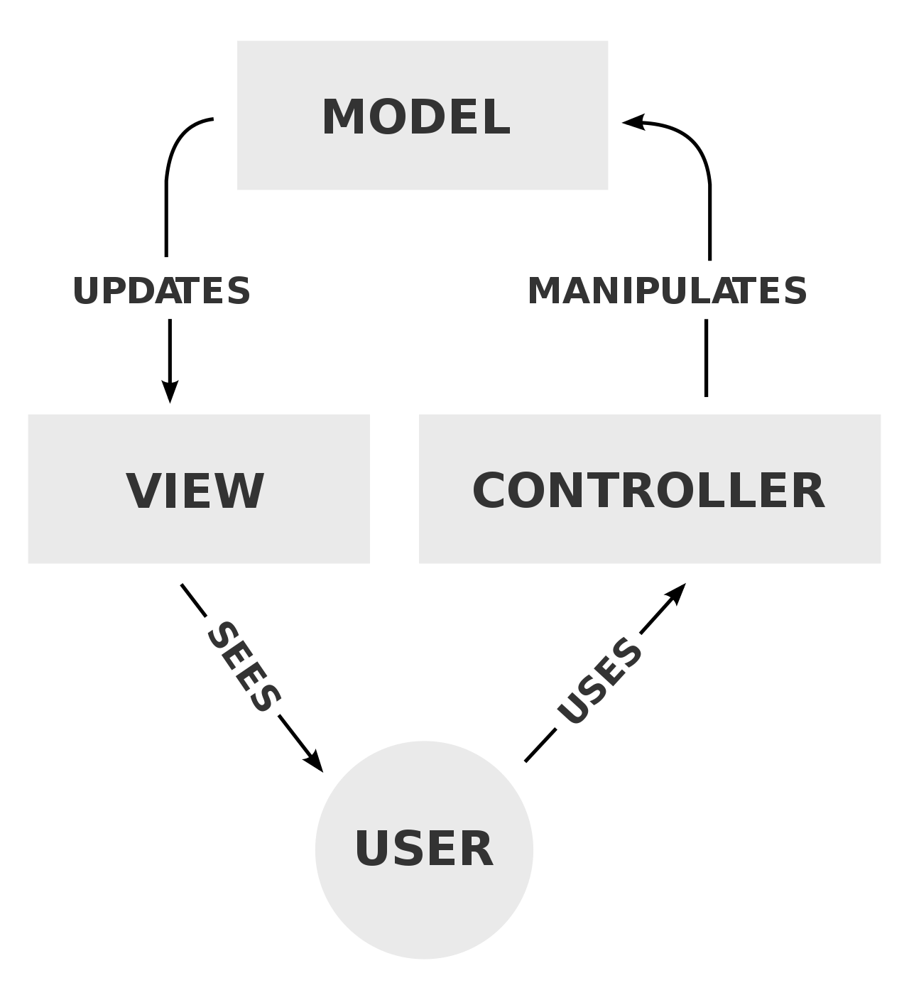

# Course Exercise

Key concepts and practice involved:

- ES6+

- Modern workflow (NPM, Babel, webpack...)

- [MVC design pattern](https://www.geeksforgeeks.org/mvc-design-pattern/)

  - **M** - **Model**, the data model.
    It's the central component of the pattern, independent of the user interface. It manages data of the application, receives user input through and be manipulated by the **Controller**.
  - **V** - **View**, the information presentation. What user sees. It presents information of **Data** in perticular format to the user.
  - **C** - **Controller**, the control interface. It responses to user input and perform interaction on **Data** model object.

